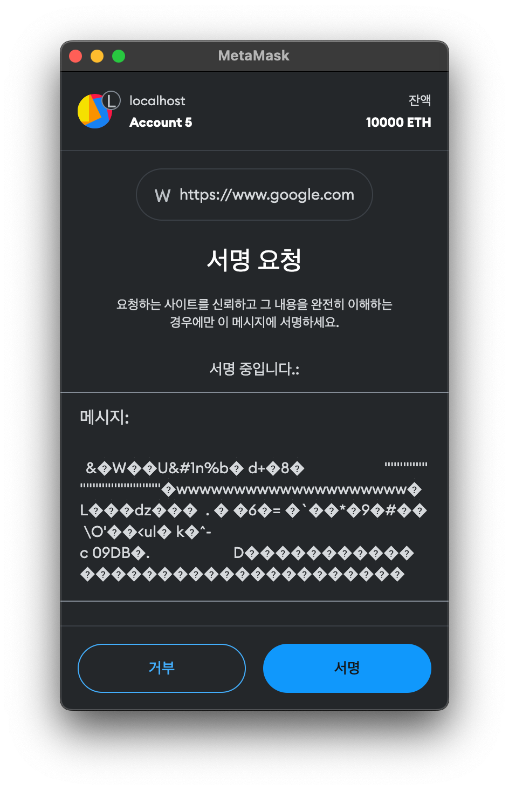
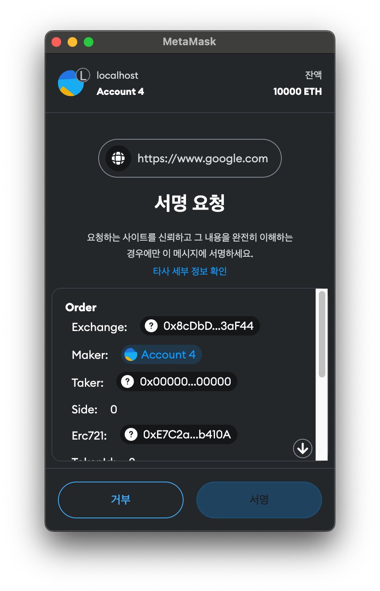

# EIP-712

# 개요

NFT 마켓에서는 내가 주문을 생성하거나 다른 사람에게 구매 제안(Offer) 을 하기 위해서
On-Chain 으로 주문을 생성하는 것이 아니라 오프체인에서 주문을 생성할 수 있다.

오프체인에서 주문 생성 후 주문을 생성한 사람이 서명을 함으로써 "이 주문은 내가(이 지갑이) 생성했음" 을 증명할 수 있다.

주문과 주문에 대한 서명은 오프체인(NFT 마켓플레이스 서비스의 DB 등) 에 저장되어 거래소에서 리스팅되어 있다가
구매자와 판매자가 매칭되면 온체인에서 해당 주문이 처리된다.

마켓플레이스를 구현하기 전, 오프체인에서 주문을 생성하고, 서명하는 과정 및 컨트랙트에서 주문 및 주문 서명을 검증하는 과정을 구현해보자.

## 주문 구조체 생성

Wyvern Protocol 의 주문에는 다음과 같은 정보가 들어가 있다.

```solidity
struct Order {
    address exchange;
    address maker;
    address taker;
    uint makerRelayerFee;
    uint takerRelayerFee;
    uint makerProtocolFee;
    uint takerProtocolFee;
    address feeRecipient;
    FeeMethod feeMethod;
    SaleKindInterface.Side side;
    SaleKindInterface.SaleKind saleKind;
    address target;
    AuthenticatedProxy.HowToCall howToCall;
    bytes calldata_;
    bytes replacementPattern;
    address staticTarget;
    bytes staticExtradata;
    address paymentToken;
    uint basePrice;
    uint extra;
    uint listingTime;
    uint expirationTime;
    uint salt;
}
```

내가 Bored Ape Yacht Club NFT 의 첫번째 NFT 를 100ETH 에 구매하겠다는 제안을 하는 주문을 생성한다고 가정해보자.

```solidity
Order memory order = Order({
    exchange: address(0x7f268357A8c2552623316e2562D90e642bB538E5),
    maker: address(0x1111111111111111111111111111111111111111),
    taker: address(0x2222222222222222222222222222222222222222),
    makerRelayerFee: 250,
    takerRelayerFee: 0,
    makerProtocolFee: 0,
    takerProtocolFee: 0,
    feeRecipient: address(0x7777777777777777777777777777777777777777),
    feeMethod: FeeMethod.ProtocolFee,
    side: SaleKindInterface.Side.Buy,
    saleKind: SaleKindInterface.SaleKind.FixedPrice,
    target: address(0xBC4CA0EdA7647A8aB7C2061c2E118A18a936f13D),
    howToCall: HowToCall.Call,
    calldata_: hex"42842e0e00000000000000000000000000000000000000000000000000000000000000000000000000000000000000001111111111111111111111111111111111111111",
    replacementPattern: hex"00000000ffffffffffffffffffffffffffffffffffffffffffffffffffffffffffffffff0000000000000000000000000000000000000000000000000000000000000000",
    staticTarget: address(0),
    staticExtradata: hex"",
    paymentToken: address(0xC02aaA39b223FE8D0A0e5C4F27eAD9083C756Cc2),
    basePrice: 100000000000000000000,
    extra: 0,
    listingTime: 0,
    expirationTime: 0,
    salt: 12345
});
```

이를 ByteCode 로 표현하면 이렇게 된다.

```
0x0000000000000000000000007f268357a8c2552623316e2562d90e642bb538e50000000000000000000000001111111111111111111111111111111111111111000000000000000000000000222222222222222222222222222222222222222200000000000000000000000000000000000000000000000000000000000000fa0000000000000000000000000000000000000000000000000000000000000000000000000000000000000000000000000000000000000000000000000000000000000000000000000000000000000000000000000000000000000000000000000000000000000000000000007777777777777777777777777777777777777777000000000000000000000000000000000000000000000000000000000000000000000000000000000000000000000000000000000000000000000000000000000000000000000000000000000000000000000000000000000000000000000000000000000000000000000000bc4ca0eda7647a8ab7c2061c2e118a18a936f13d000000000000000000000000000000000000000000000000000000000000000000000000000000000000000000000000000000000000000000000000000002e00000000000000000000000000000000000000000000000000000000000000360000000000000000000000000000000000000000000000000000000000000000000000000000000000000000000000000000000000000000000000000000003e0000000000000000000000000c02aaa39b223fe8d0a0e5c4f27ead9083c756cc20000000000000000000000000000000000000000000000056bc75e2d631000000000000000000000000000000000000000000000000000000000000000000000000000000000000000000000000000000000000000000000000000000000000000000000000000000000000000000000000000000000000000000000000000000000000000000000000000000000000000000000000000000000000000003039000000000000000000000000000000000000000000000000000000000000004442842e0e0000000000000000000000000000000000000000000000000000000000000000000000000000000000000000111111111111111111111111111111111111111100000000000000000000000000000000000000000000000000000000000000000000000000000000000000000000000000000000000000000000004400000000ffffffffffffffffffffffffffffffffffffffffffffffffffffffffffffffff0000000000000000000000000000000000000000000000000000000000000000000000000000000000000000000000000000000000000000000000000000000000000000000000000000000000000000000000000000000000000000...
```

## 지갑 서명

이 ByteCode 를 지갑에서 서명을 하면, 다음과 같이 될 것이다. 



하지만, 유저 입장에서는 위와 같은 창이 뜨면 내가 주문을 제대로 생성하는 것이 맞는지, 정확히 어떤 것에 대해서 서명하는 것인지를 명확하게 알 수 없다.
따라서 유저 지갑에서 서명할 때 "내가 어떤 값에 대하여 서명을 진행하는 것인가" 를 명확하게 보여줄 필요가 있다. 이를 위한 표준이 EIP-712 이다.

EIP-712 표준대로 서명 요청을 하게 되면 아래와 같이 유저에게 더 명확하게 서명 데이터를 보여줄 수 있다.



## EIP-712

### domain separator

먼저 EIP-712 서명을 위해서는 domainSeparator 라는 값이 필요하다. domainSeparator 은 이름(임의로 지정), 버전(임의로 지정), 
chain id, 컨트랙트 주소가 담겨있는 값을 keccak256 으로 해싱한 32바이트 값이다. 이를 통해서 같은 형태의 구조체 데이터라 할지라도
체인이 다르거나(ex. 이더리움, 폴리곤 등) 컨트랙트 주소가 다른 경우 다른 domainSeparator 값을 가지고 있기 때문에 호환이 되지 않는다.

따라서 replay attack 을 방지하는 용도로 사용된다. (ex. 내가 A 컨트랙트에서 거래를 위해 데이터 X 를 서명했는데 이것이 다른 B 컨트랙트에서 재사용할 수 없다)

DomainSeparator 는 표준에 따라 아래와 같이 해싱한 결과 값 32바이트이다.

```solidity
keccak256(
    abi.encode(
        keccak256("EIP712Domain(string name,string version,uint256 chainId,address verifyingContract)"),
        keccak256(name),
        keccak256(version),
        keccak256(chainId),
        address(this)
    )
)
```

name 과 version 은 dApp 이름 등 개발자가 임의의 이름과 버전을 지정해주면 되며, chainId 와 address 부분은 각각
해당 컨트랙트가 배포되어 있는 블록체인의 체인 아이디와 컨트랙트 주소가 담겨있어야 한다.

### encodeType

encodeType 은 구조체의 타입에 대한 인코딩 값이다. 값은

`name + "(" + param1 + "," + param2 + "," + ... + ")"`, 각각 param 은 `type + " " + name` 으로 표현된다.

예를 들어, 아래와 같이

```solidity
struct Mail {
    address from;
    address to;
    string contents;
}
```

구조체가 선언되어 있다고 할 때, 이 구조체의 encodeType 값은

`Mail(address from,address to,string contents)` 이다.

이 때, 이 값을 keccak256 으로 해싱한 값 `keccak256("Mail(address from,address to,string contents)")` 을 typeHash 라고 한다.

### encodeData

encodeData 는 구조체 데이터를 인코딩한 값이다.

각각 구조체 데이터마다 32바이트로 패딩된 형태를 가지며,

- Boolean 값의 경우 uint256 형태의 0(False), 1(True) 값을 가진다.
- uin160, address 값의 경우 앞에 12바이트가 Zero Padding 된 형태를 가진다.
- bytes, string 같은 가변 형태의 변수의 경우 keccak256 으로 해싱한 형태의 값이다.
- 배열의 경우, 각각 배열 요소를 encodeData 로 인코딩된 값을 CONCAT 한 값의 keccak256 값이다.

예를 들어, `Mail(0x1111111111111111111111111111111111111111, 0x2222222222222222222222222222222222222222, "Hello, world!")` 구조체를 encodeData 로
인코딩한 값은

```
0000000000000000000000001111111111111111111111111111111111111111 // 앞의 12바이트가 Zero Padding 된 주소 (address from)
0000000000000000000000002222222222222222222222222222222222222222 // 앞의 12바이트가 Zero Padding 된 주소 (address to)
b6e16d27ac5ab427a7f68900ac5559ce272dc6c37c82b3e052246c82244c50e4 // keccak256("Hello, world!") (string contents)
```

이 된다.

## hashStruct

구조체의 해시 값으로 다음과 같이 계산된다.

```solidity
keccak256(
    abi.encode(
        keccak256(encodeType), // typeHash
        encodeData
    )
)
```

## hash to sign

실제 EIP-712 표준대로 구조체를 서명할 때, 서명해야할 메시지는 다음과 같다.

```solidity
keccak256(
    abi.encodePacked(
        "\x19\x01",
        DOMAIN_SEPARATOR,
        hashStruct(value)
    )
)
```

# Assignment

## Assignment #1

```
OrderValidator 컨트랙트 내의 `function domainSeparator()` 함수를 구현하시오.
```

- domainSeparator 함수는 OrderValidator 컨트랙트에 대한 EIP-712 domain separator 값 32바이트를 리턴하여야 한다.
- domain separator 의 name 은 `Upside`, version 은 `1.0` 으로 한다.

## Assignment #2

```
OrderValidator 컨트랙트 내의 `function orderTypeHash()` 함수를 구현하시오.
```

- orderTypeHash 함수는 Order 구조체에 대한 EIP-712 encodeType 값을 keccak256 으로 해싱한 값이다.

## Assignment #3

```
OrderValidator 컨트랙트 내에서 `hashOrder` 함수를 구현하시오.
```

- `hashOrder` 함수는 order 파라미터를 받아서 이 order 의 EIP-712 의 `hashStruct` 값을 리턴해야 한다.
 
## Assignment #4

```
OrderValidator 컨트랙트 내에서 `hashToSign` 함수를 구현하시오.
```

- Assignment #3 에서 구현한 hashOrder 를 가지고, 위 개요에서의 hash to sign 을 참고하여, 실제로 EIP-712 표준에 따른 지갑에서 서명해야할 해시 값을 리턴해야 한다.
